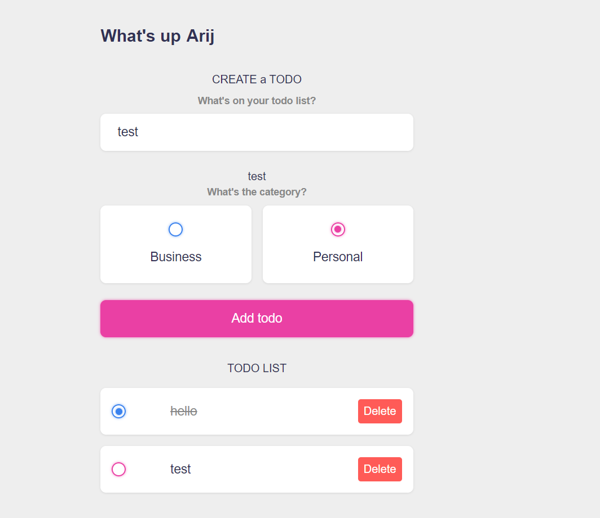

## Todo App with Vue.js and Vite
**This application allows you to efficiently manage your tasks by creating, deleting, modifying, and checking them off**
**The data is stored in the browser's local storage**

